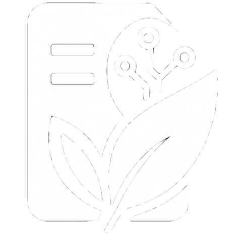

# Kasa Umbrel Community App Store (傘)

Kasa (傘) means "umbrella" in Japanese, a nod to Umbrel's umbrella logo. This is an independent community app store and is **not affiliated** with the official Umbrel team.

## Available Apps

| # | Icon | App | Description | Port |
|:-:|:----:|:----|:------------|:----:|
| 1 |  | [AzuraCast](kasa-azuracast) | Self-hosted radio streaming and station management | 3004 |
| 2 |  | [Cal.com](kasa-calcom) | Open-source scheduling for teams and individuals | 3002 |
| 3 |  | [Paperless-AI](kasa-paperless-ai) | AI tagging and RAG search for Paperless-ngx | 3001 |
| 4 |  | [Paperless-GPT](kasa-paperless-gpt) | LLM-powered OCR and tagging for Paperless-ngx | 3003 |

## App Dependencies

| App | Requirements |
|:----|:-------------|
| AzuraCast | Standalone - no external dependencies |
| Cal.com | Standalone - no external dependencies |
| Paperless-AI | Requires [Paperless-ngx](https://apps.umbrel.com/app/paperless-ngx) and an LLM provider (Ollama or OpenAI-compatible API) |
| Paperless-GPT | Requires [Paperless-ngx](https://apps.umbrel.com/app/paperless-ngx) and [Ollama](https://apps.umbrel.com/app/ollama) or another LLM provider |

## Installation

1. Open Umbrel UI → App Store → Community App Stores
2. Add this repository URL: `https://github.com/willrobin/umbrel-community-app-store`
3. Install apps as usual from the Kasa section


## Port Allocation

This app store uses the following ports:

| Service | Port(s) |
|:--------|:--------|
| Paperless-AI | 3001 |
| Cal.com | 3002 |
| Paperless-GPT | 3003 |
| AzuraCast (Web UI) | 3004 |
| AzuraCast (Streaming) | 20000-20050 |

These ports were selected to avoid conflicts with other known community app stores.

## Data Persistence

All app data is stored under Umbrel's managed `${APP_DATA_DIR}` directory. Each app uses this variable to ensure data persists across updates and restarts.

## Development

### Prerequisites

- Git
- yamllint (optional, for YAML validation)

### Workflow

```bash
# Create a new app scaffold
./scripts/new-app.sh <app-id> "<App Name>"

# Edit app files in apps/<app-id>/

# Publish apps to repository root (required by Umbrel)
./scripts/publish.sh

# Validate all apps
./scripts/validate.sh
```

### App Structure

Each app requires these files:

```
apps/<app-id>/
├── umbrel-app.yml      # App manifest for Umbrel
├── docker-compose.yml  # Docker service definitions
└── README.md           # App-specific documentation
```

## Contributing

- App ideas and issues welcome via [GitHub Issues](https://github.com/willrobin/umbrel-community-app-store/issues)
- Please do not commit secrets or credentials
- See [CONTRIBUTING.md](CONTRIBUTING.md) for detailed guidelines

## License

This community app store is provided as-is for educational and personal use. Individual apps retain their respective licenses from their original developers.

## Credits

Maintained by **Kasa** | [GitHub Repository](https://github.com/willrobin/umbrel-community-app-store)
