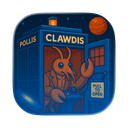

# Kasa Umbrel Community App Store

Kasa (傘) means "umbrella" in Japanese, a nod to Umbrel's umbrella logo. This is an independent community app store and is not affiliated with the official Umbrel team.

## Available Apps

| # | Icon | App | Description | Port |
| :-: | :-: | :-- | :-- | :-: |
| 1 |  | [AzuraCast](apps/kasa-azuracast) | Self-hosted radio streaming and station management | 3004 |
| 2 |  | [Cal.com](apps/kasa-calcom) | Open-source scheduling for teams and individuals | 3002 |
| 3 |  | [Moltbot](apps/kasa-moltbot) | Personal AI assistant with multi-channel messaging | 3007 |
| 4 |  | [Music Assistant](apps/kasa-music-assistant) | Unified music streaming for local and online sources | 3005 |
| 5 |  | [Paperless-AI](apps/kasa-paperless-ai) | AI tagging and RAG search for Paperless-ngx | 3001 |
| 6 |  | [Paperless-GPT](apps/kasa-paperless-gpt) | LLM-powered OCR and tagging for Paperless-ngx | 3003 |
| 7 |  | [Compose Patcher](apps/kasa-compose-patcher) | Auto-repatch Docker-Compose files after Umbrel app updates | 3008 |

## App Dependencies

- **Paperless-AI** and **Paperless-GPT** require a running Paperless-ngx instance
- **Moltbot** requires an AI provider API key (Anthropic or OpenAI). Configure via WebChat UI after install
- AI features require an LLM provider (e.g., Ollama or OpenAI). See individual app READMEs for details
- **Compose Patcher** requires a host-level daemon installed via SSH (see [host/README.md](host/README.md))

## Installation

1. Open Umbrel UI → App Store → Community App Stores
2. Add this repository URL: `https://github.com/willrobin/umbrel-community-app-store`
3. Install apps as usual from the Kasa section


## Port Allocation

| Port | App |
|------|-----|
| 3001 | Paperless-AI |
| 3002 | Cal.com |
| 3003 | Paperless-GPT |
| 3004 | AzuraCast Web UI |
| 3005 | Music Assistant (Webserver) |
| 3006 | Music Assistant (Streams) |
| 3007 | Moltbot |
| 3008 | Compose Patcher |
| 8000–8010 | AzuraCast Streaming |

No port conflicts with other known community app stores (verified as of January 2026).

## Data Storage

- All app data is stored under `${APP_DATA_DIR}` (set by Umbrel per app)
- Data persists across updates and reinstalls
- Backup your Umbrel data directory to preserve app configurations

## Development

### Creating a New App

```bash
./scripts/new-app.sh <app-id> "<App Name>"
```

### Workflow

1. Create app scaffold: `./scripts/new-app.sh kasa-myapp "My App"`
2. Edit files in `apps/kasa-myapp/`
3. Publish to root: `./scripts/publish.sh`
4. Validate configs: `./scripts/validate.sh`
5. Commit and push

### Scripts

| Script | Purpose |
|--------|---------|
| `scripts/new-app.sh` | Create new app scaffold |
| `scripts/publish.sh` | Sync apps to root level |
| `scripts/validate.sh` | Validate YAML configurations |

## Contributing

- App ideas and issues are welcome via GitHub Issues
- Never commit secrets or API keys to the repository
- Follow the [contribution guidelines](CONTRIBUTING.md)
- See [development documentation](DEVELOPMENT.md) for detailed workflow

## License

This community app store is provided as-is. Individual apps retain their original licenses.
